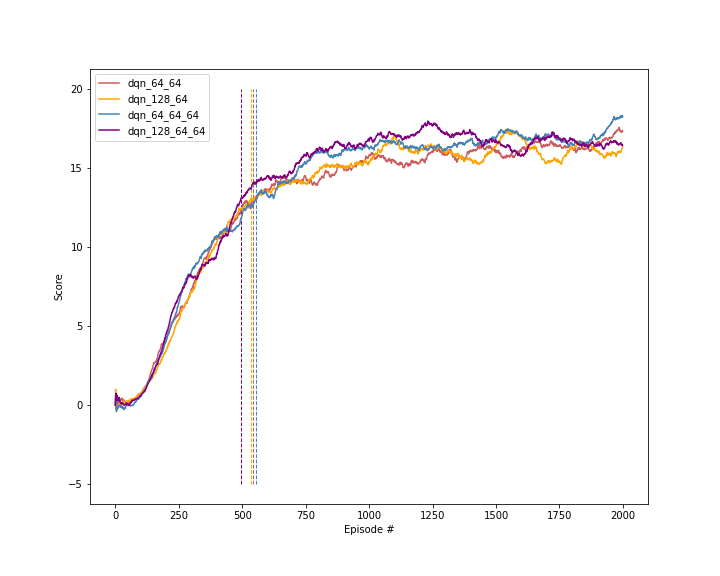

# Project 1: Navigation
Several architectures and hyper-parameter setups were considered for solving the problem. All of them reached the
average score of 13+ on 100 consecutive runs, so we will focus here on comparing the most prominent setups based on
their top scores and how many episodes they needed to solve the navigation problem.

## Q-Network architectures
### Comparing the performance of some architectures
In the core of each agent was a network which estimated the Q-function. All networks were fully connected networks
consisting solely of linear layers and ReLU activations. Batch normalization was briefly tested, but discarded because
it didn't offer any improvement. A couple of different setups were considered and tested on 2000 episodes. Their
performances were very comparable as one can see in the following figure:

- The numbers separated by `_` designate the
width of each dense layer of the network
- The vertical dashed lines mark the first episode where the average score surpassed 13

Based on the similarity of the results, the network with three hidden layers of widths (64, 64, 64) was picked in order
to make sure the performance of setups to be tested is not hindered by a lack of network capacity. This architecture
was fix throughout all of the experiments described below.

### Dueling DQN
A second network is defined which implements the dueling DQN architecture. The output of the last 64 width layer of the
(64, 64, 64) network mentioned above is used as input to 2 dense networks which compute respectively the value of the
input state and the advantage of the state-action combination. The Q function is then computed as follows:

$Q(s, a) = V(s) + (A(s, a) - E_{a'\in\mathcal{A}}[A(s, a')])$

Both the A and V networks have two layer with sizes (64, 32) and they output respectively $|\mathcal{A}|$ and 1
values.

The rest of the training process of the network remains the same and the premise is that the agent will learn both
long-term strategies leading to better values (e.g. moving to areas with higher yellow to blue banana ration) and
short-term strategies (e.g. collecting yellow bananas and avoiding blue ones), leading to a better performance.

For more on dueling DQN, look at the (paper which introduced the method)[https://arxiv.org/abs/1511.06581].

## Network Training setup
### Hyper parameters
The hyper parameters directly related to the network training were the following:
- learning rate: Check the section below
- batch size: This was fixed to 64
- hidden layers: This set the number of hidden layers of the backbone fully connected network and their with. After a
    short experimentation was fixed to (64, 64, 64)
- dueling_dqn: Flag to toggle use of the dueling DQN architecture
    
### Learning rate
It was initially set to 1e-5 but after a couple of experiments, it was evident that the network would benefit from a
higher value, at least on the first episodes. This let to using the relatively high rate of 1e-3 in the beginning of
training and later on decreasing it on plateaus with a scheduler provided by PyTorch. This was a crucial step, as it
 helped the network train fast and reach the value of 13 earlier than before and also stabilized it later on and allowed
 to exceed the previous maximum value of ~17 and also reduce score oscillations on the second half of training.

## Q-Learning setup
### Hyper parameters
The following hyper parameters were used for the Q-learning parts not directly related to the network:
- number_of_episodes: This was fixed to 2000 for all experiments
- maximum_timestaps: 1000
- initial_epsilon: The exploration rate started from 1.0
- final_epsilon: Then decayed to 0.01
- epsilon_decay: With a decay rate of 0.995
- double_dqn: Flag to toggle use of double DQN
- prioritize_replay: Flag to toggle use of priority experience replay
- per_alpha: In case prioritized replay is on, set its constant alpha
- per_beta_0: In case prioritized replay is on, set the initial value of $\beta$. $\beta$ will decay linearly
    starting from $\beta_0$ on the first episode and becoming 1.0 on the last episode.
    
### Double DQN

### Prioritized experience replay
Prioritized replay controls how the examples used to train the model are picked. Namely, a probability function defined
over all examples gathered in the replay buffer is used and assigns higher probabilities to examples whose Q values
estimated using actual rewards deviate more from the Q values computed directly from the Q-network. The implementation
involved the introduction of a new buffer which stores priorities along with updates based on the aforementioned errors
and also samples based on the distribution defined by them.

In order to make sampling efficient, one has to introduce an efficient structure such as a sum tree. This was avoided
here in order to save time and was not a real problem given that the number of episodes was fairly low. A couple of
cheap caching tricks (mainly on the calculation of the maximum priority) were enough to make the implementation 
fast enough.

For more on prioritized replay, look at the (paper which introduced the method)[https://arxiv.org/abs/1511.05952].

### CPU vs GPU
Given the small size of the networks used and the fact there is a constant conversion from tensors to numpy arrays,
it is faster training on cpu, probably because of avoiding intermediate translation steps. If a version of Unity
native to PyTorch was available, then probably one could get significant gains.

## Most prominent setups
### Setups
### Reward comparison

## Future ideas to improve performance
### Error analysis
### Use a high level framework
### Rainbow
### Stratify prioritized experience replay based on novelty
